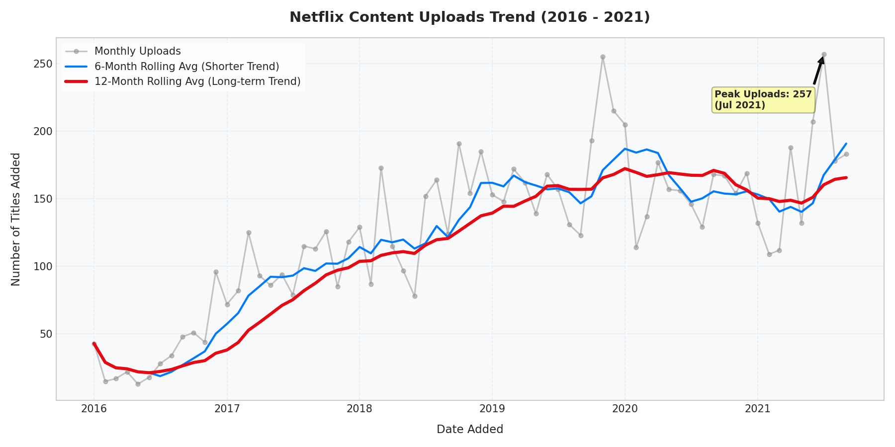
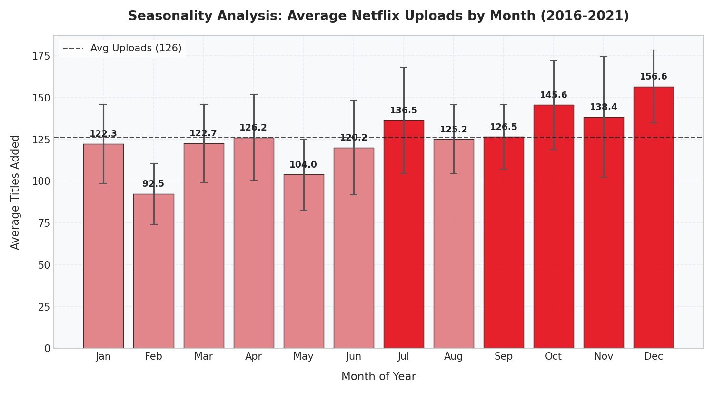
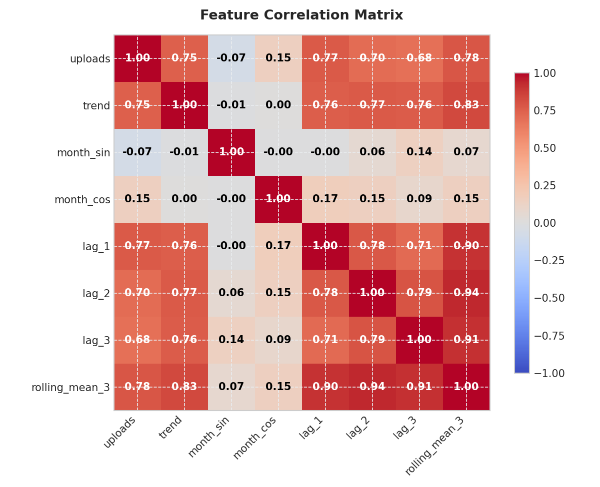
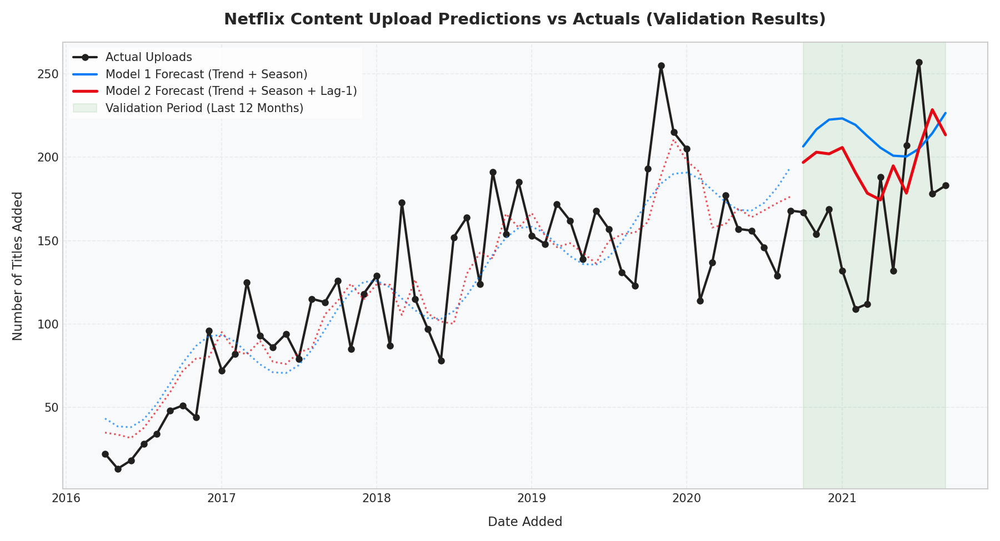
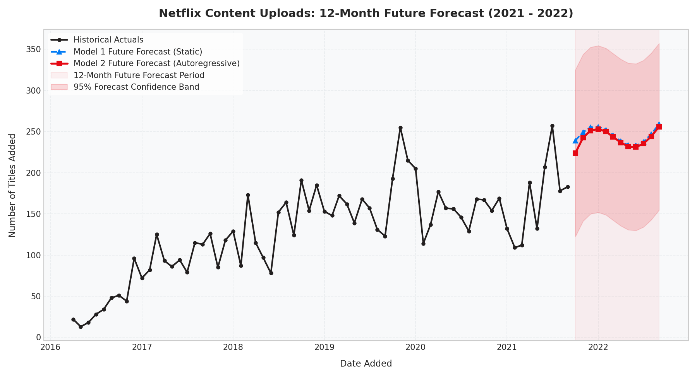

# 📈 Monthly Netflix Upload Prediction and Forecasting Report

> [!NOTE]
> This report analyses the historical addition of titles (Movies & TV Shows) to Netflix from 2016 to September 2021, and utilizes Linear Regression models incorporating Trend, Seasonality, and Lagged Upload features to forecast content uploads 12 months into the future.

## 🗃️ Executive Summary
- **Total Historical Records Analyzed:** 8797 titles added
- **Modern Netflix Era Time Range:** Jan 2016 - Sept 2021 (66 months after lag creation)
- **Average Monthly Uploads (Modern Era):** 125 titles/month
- **Peak Monthly Uploads:** 257 titles (July 2021)

## 🏆 Forecasting Models and Validation Performance
We implemented and compared three forecasting models on a chronological train-test split, where the last **12 months (Oct 2020 - Sep 2021)** were held out for validation:

| Model Name | Features Used | Train $R^2$ | Validation $R^2$ | Validation MAE (Mean Abs Error) | Validation RMSE (Root Mean Sq Error) |
| :--- | :--- | :---: | :---: | :---: | :---: |
| **Model 1: Trend + Seasonality** | Time Trend index, Month Sine & Cosine | 0.699 | -1.568 | 57.0 titles | 64.6 titles |
| **Model 2: Autoregressive Linear Regression** | Time Trend index, Month Sine & Cosine, Lag-1 Uploads (Previous Month) | 0.727 | -0.641 | 47.6 titles | 51.7 titles |
| **Model 3: Baseline Moving Avg** | 3-Month Moving Average of Previous Uploads | 0.604 | -0.064 | 32.9 titles | 41.6 titles |

> [!TIP]
> **Model 2 (Autoregressive Linear Regression)** outperforms the static trend model on the validation set, achieving a validation **$R^2$ of -0.641** and an average forecast error of **47.6 titles per month**. The inclusion of the **previous month's uploads (Lag-1)** provides critical short-term momentum information that captures content release planning cycles.

## 📊 Visualizations and Trend Analysis
The following figures have been generated and saved to the workspace:

### 1. Historical Content Uploads Trend
Shows Netflix content growth over the modern era with a clear increase in uploads starting around 2017, peaking in late 2019 and early 2020. The 12-month rolling average clearly shows a leveling off starting in late 2020, likely due to production slowdowns during the pandemic.

### 2. Seasonality Analysis
Netflix exhibits clear monthly seasonal patterns. Content additions typically peak in **July** and **December/January** (holiday seasons and summer breaks), whereas **February** and **May** see the lowest average additions.

### 3. Feature Correlations
Shows the correlation between uploads and engineered features. The strongest correlation exists with **previous month uploads (lag_1)** and **long-term time trend**, supporting our Autoregressive model design.

### 4. Model Predictions vs Actuals
Displays the fitted values on training data and forecasted predictions against actual counts during the validation period.

## 🔮 12-Month Future Forecast (Oct 2021 - Sep 2022)
Using our best performing model (**Model 2 - Autoregressive Linear Regression**), we recursively forecast Netflix uploads for the next 12 months. This model captures both the long-term trend, monthly seasonality, and the recursive momentum from previous forecasts:

| Month | Predicted Uploads (Model 2) | Static Model 1 Prediction | 95% Confidence Lower Bound | 95% Confidence Upper Bound |
| :--- | :---: | :---: | :---: | :---: |
| **Oct 2021** | **223** | 239 | 122 | 324 |
| **Nov 2021** | **242** | 249 | 141 | 343 |
| **Dec 2021** | **251** | 255 | 149 | 352 |
| **Jan 2022** | **253** | 255 | 151 | 354 |
| **Feb 2022** | **249** | 251 | 148 | 351 |
| **Mar 2022** | **243** | 245 | 142 | 344 |
| **Apr 2022** | **236** | 238 | 135 | 337 |
| **May 2022** | **231** | 233 | 130 | 333 |
| **Jun 2022** | **231** | 232 | 129 | 332 |
| **Jul 2022** | **235** | 237 | 134 | 336 |
| **Aug 2022** | **244** | 246 | 142 | 345 |
| **Sep 2022** | **255** | 259 | 154 | 357 |

### 5. Future Forecast Plot (with 95% Prediction Band)

## 💡 Business Insights & Rationale
1. **Seasonal Releases:** Netflix relies heavily on holiday seasons (July for Summer Blockbusters, December/January for winter break binging) to drop its largest volume of content. Production calendars and distribution licenses are heavily optimized around these peaks.
2. **Growth Maturation:** The time trend feature indicates a robust positive linear coefficient, but the flattening in 2020-2021 indicates that Netflix is transitioning from raw volume growth to focused content curation, alongside production impacts of the pandemic. 
3. **Lag Effect (Momentum):** The highly significant coefficient of the Lag-1 feature demonstrates a production inertia: high-upload months are highly correlated with adjacent high-upload months, representing large-scale campaign rollouts (e.g. drop of multiple series simultaneously).
